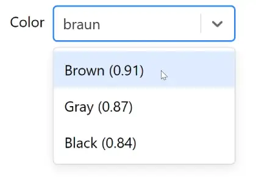

# Use Similarity Select 

  

**Use Similarity Select** is a user-friendly hook designed to enhance your select components with powerful similarity-based filtering, all while seamlessly integrating with the popular `react-select` library. 
This project empowers developers to offer end-users an intuitive selection experience, ignoring typos and spelling mistakes.

## Features For End-Users

- **Intuitive Similarity-Based Filtering**: Offers real-time suggestions based on similarity to the user's input, making it easier to find the desired option among a long list of options.

### Examples

#### American "Gray" works also when typing British "Grey"


#### A user that don't know how to spell Brown, will still get the correct result


## Features For Developers
- **Easy Integration with React-Select**: Designed as a hook to work hand-in-glove with `react-select`, adding on to its capabilities without losing any of its original features.
- **Lightweight and Efficient**: Crafted with performance in mind, ensuring a smooth experience even with large datasets.
- **Open Source**: MIT licensed, welcoming contributions and improvements from the community.

## Installation

To integrate Use Similarity Select into your project, run the following command:

```bash
npm install use-similarity-select
```

or if you use yarn:

```bash
yarn add use-similarity-select
```

## Usage

Here’s how you can quickly integrate Use Similarity Select with `react-select`:

```jsx
import React from 'react';
import Select from 'react-select';
import useSimilaritySelect from 'use-similarity-select/react-select';

const initialOptions = [
  { value: 'chocolate', label: 'Chocolate' },
  { value: 'strawberry', label: 'Strawberry' },
  { value: 'vanilla', label: 'Vanilla' }
];

function App() {
  const [inputValue, setInputValue] = React.useState('');
  const {options, onInputChange, filterOption} = useSimilaritySelect({
    initialOptions,
    addDistance: true, // For debugging purposes, show the distance
  }, inputValue);

  return (
    <Select
        options={options}
        onInputChange={onInputChange}
        filterOption={filterOption}
        placeholder="Start typing..."
    />
  );
}

export default App;
```

### Notice: Optimizing Options Array Creation

To ensure optimal performance, avoid creating the `initialOptions` array within the component render. This approach prevents unnecessary re-renders and enhances performance. Instead, define your `initialOptions` array outside the component or use the `useMemo` hook to memoize it. For more information on removing unnecessary object dependencies, refer to the React documentation here: [React useEffect - Removing unnecessary object dependencies](https://react.dev/reference/react/useEffect#:~:text=the%20count%20changes.-,Removing%20unnecessary%20object%20dependencies,-If%20your%20Effect).


## License

Use Similarity Select is open source software [licensed as MIT](https://github.com/yourusername/use-similarity-select/blob/main/LICENSE).

Favicon: Twemoji CC-BY 4.0


## Let's Connect!

Got questions or suggestions? Reach out to us on [GitHub Discussions](https://github.com/yourusername/use-similarity-select/discussions) or submit an issue. We're always looking to improve and would love to hear from you.
